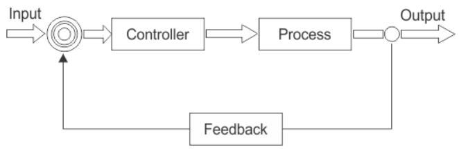
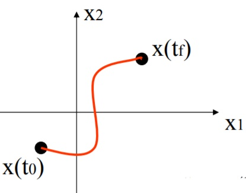
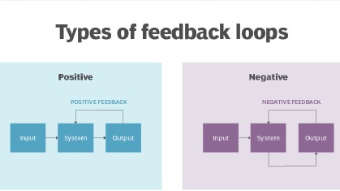

# Control Theory

A robot can exhibit a number of different behaviors, depending on the task and its environment. It can act as a source of programmed motions for tasks such as moving an object from one place to another or tracing a trajectory. It can act as a source of forces, as when applying a polishing wheel to a workpiece. In tasks such as writing on a chalkboard, it must control forces in some directions (the force must press the chalk against the board) and motions in others (the motion must be in the plane of the board). When the purpose of the robot is to act as a haptic display, rendering a virtual environment, we may want it to act like a spring, damper, or mass, yielding in response to forces applied to it.

In each of these cases, it is the job of the robot controller to convert the task specification to forces and torques at the actuators. Control strategies that achieve the behaviors described above are known as **motion control**, **force control**, **hybrid motion-force control**, or **impedance control**.

A typical control block diagram is shown above The sensors are typically: potentiometers, encoders, or resolvers for joint position and angle sensing; tachometers for joint velocity sensing; joint force-torque sensors; and/or multi-axis force-torque sensors.

## Types of control systems

### Open Loop control system

A control system in which the control action is totally independent of output of the system then it is called **open loop control system**. A manual control system is also an open loop control system. The figure below shows a control system block diagram of an open loop control system in which process output is totally independent of the controller action.

**Practical examples of Open loop control system:**

1. Electric Hand Drier – Hot air (output) comes out as long as you keep your hand under the machine, irrespective of how much your hand is dried.
2. Automatic Washing Machine – This machine runs according to the pre-set time irrespective of washing is completed or not.
3. Bread Toaster – This machine runs as per adjusted time irrespective of toasting is completed or not.

### Closed Loop control system

Control system in which the output has an effect on the input quantity in such a manner that the input quantity will adjust itself based on the output generated is called **closed loop control system**. **Open loop control system** can be converted in to closed loop control system by providing a feedback. Figure below shows the block diagram of closed loop control system in which feedback is taken from output and fed in to input.

**Practical example of Closed loop control system:**

1. Missile Launched and Auto Tracked by Radar – The direction of missile is controlled by comparing the target and position of the missile.
2. An Air Conditioner – An air conditioner functions depending upon the temperature of the room.
3. Cooling System in Car – It operates depending upon the temperature which it controls.

## Core topics in Control Theory

Before we design any controller, we have to consider the key factors that will drive the robot and how are we supposed to build the controller that will drive us to the best results which are also known as **control objectives**. These factors are listed below:

1.**Stability :** By this, we mean to measure the level of stability in the signal which will drive the object and also keep a check on the fluctuation of the signal. For eg. if we are making a cruise controller for a car, then the controller should give a stable signal after the car has reached the cruising speed and the speed should remain constant (no fluctuations).

2.**Tracking :** It is necessary to give controls after analyzing the response given due to the input signal. For instance, in a cruise controller, after setting up cruising speed, it is necessary for the controller to keep a regular check on the speed by which it can decide whether to accelerate or retard.

3.**Robustness :** Robust control systems often incorporate advanced topologies which include multiple feedback loops and feed-forward paths. The control laws may be represented by high order transfer functions required to simultaneously accomplish desired disturbance rejection performance with robust closed loop operation. For example, the controller should not be hard coded to function only for a certain velocity ,say 50 miles/hour if designing a cruise control.

4.**Disturbance :** It refers to the noise (not useful signal) that the controller might signal while sending or any sort of attenuation that can happen. It actually depends on the quality of instruments used in making a controller and also due to some external factors.

5.**Optimality :** It is a set of differential equations that describe the paths of the control variables that minimize the cost function.

## Laplace transform

The Laplace transform plays a important role in control theory. It appears in the description of linear time invariant systems, where it changes convolution operators into multiplication operators and allows to define the transfer function of a system. The properties of systems can be then translated into properties of the transfer function. It allows the use of graphical methods to predict system performance without solving the differential equations of the system. These include response, steady state behavior, and transient behavior.

### Laplace Vs Fourier transform

Laplace transform: 
$F(s)=\int_{0}^{\infty}f(t)e^{-st}dt  \qquad f^{'}(t)\Rightarrow sF(s)$  
Fourier transform: 
$F(\omega) = \int_{-\infty}^{\infty}f(t)e^{-j\omega t}dt$  
Laplace transforms often depend on the initial value of the function whereas Fourier transforms are independent of the initial value. The transforms are only the same if the function is the same both sides of the y-axis (so the unit step function is different). 

To understand Laplace transform in detail read [this](https://www.electrical4u.com/laplace-transformation/) article

## Closed Loop Transfer Function

A **closed-loop transfer function** in control theory is a mathematical expression describing the net result of the effects of a closed feedback loop on the input signal to the circuits enclosed by the loop.

Where: block G represents the open-loop gains of the controller or system and is the forward path, and block H represents the gain of the sensor, transducer or measurement system in the feedback path.

To find the transfer function of the closed-loop system above, we must first calculate the output signal θo in terms of the input signal θi. To do so, we can easily write the equations of the given block-diagram as follows.

The output from the system is equal to:  Output = G x Error

Note that the error signal, θe is also the input to the feed-forward block: G

The output from the summing point is equal to:  Error = Input - H x Output

If H = 1 (unity feedback) then:

The output from the summing point will be:  Error (θe) = Input - Output

Eliminating the error term, then:

The output is equal to:  Output = G x (Input - H x Output)

Therefore:  G x Input = Output + G x H x Output

Rearranging the above gives us the closed-loop transfer function of:

## Controllability

 

## Types of Feedback Control

### Positive Feedback

In a “positive feedback control system”, the set point and output values are added together by the controller as the feedback is “in-phase” with the input. The effect of positive (or regenerative) feedback is to “increase” the systems gain, i.e, the overall gain with positive feedback applied will be greater than the gain without feedback]

### Negative Feedback

In a “negative feedback control system”, the set point and output values are subtracted from each other as the feedback is “out-of-phase” with the original input. The effect of negative (or degenerative) feedback is to “reduce” the gain. As a rule negative feedback systems are more stable than positive feedback systems. Negative feedback also makes systems more immune to random variations in component values and inputs.

To know more about different types of control systems you can read [this](https://www.electrical4u.com/types-of-systems-linear-and-non-linear-system/) article.