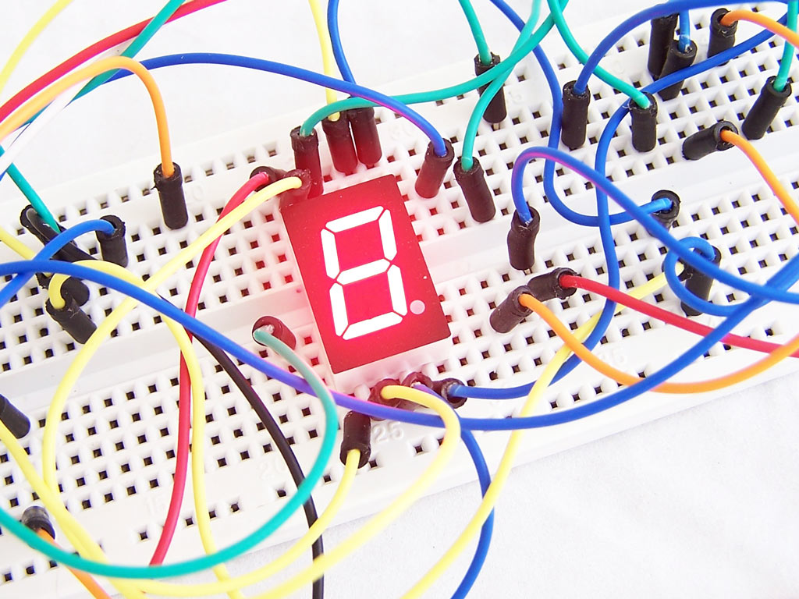

# Breadboards

The breadboard is the most fundamental tool for electronics prototyping. They are great for creating temporary circuits and require absolutely no soldering.

{: style="height:350px"}

## How to use a breadboard

A solderless breadboard consists of several holes, where wires or leads of electrical can be inserted. Each row of 5 holes is electrically connected by metal clips hidden underneath the surface. 

{: style="height:200px"}

Thus, one can connect two components by inserting them into holes of the same row. ICs can be inserted across the central ridge, and connections made as shown below.

{: style="height:200px"}

On either side of the breadboard are the _power rails_. Each power rail has two long electrically connected rows, and are often connected to batteries or some other power source.

For a more extensive breadboard tutorial, check out this [sparkfun guide](https://learn.sparkfun.com/tutorials/how-to-use-a-breadboard/all). 

## Tips for breadboard usage

1. To make breadboard connections, DuPont style jumper wires or single core 22AWG wire is most convenient. Avoid multistranded wire. 

2. Keep wires and wire leads as short as possible, to avoid clutter and make troubleshooting easier. 

{: style="height:200px"}
