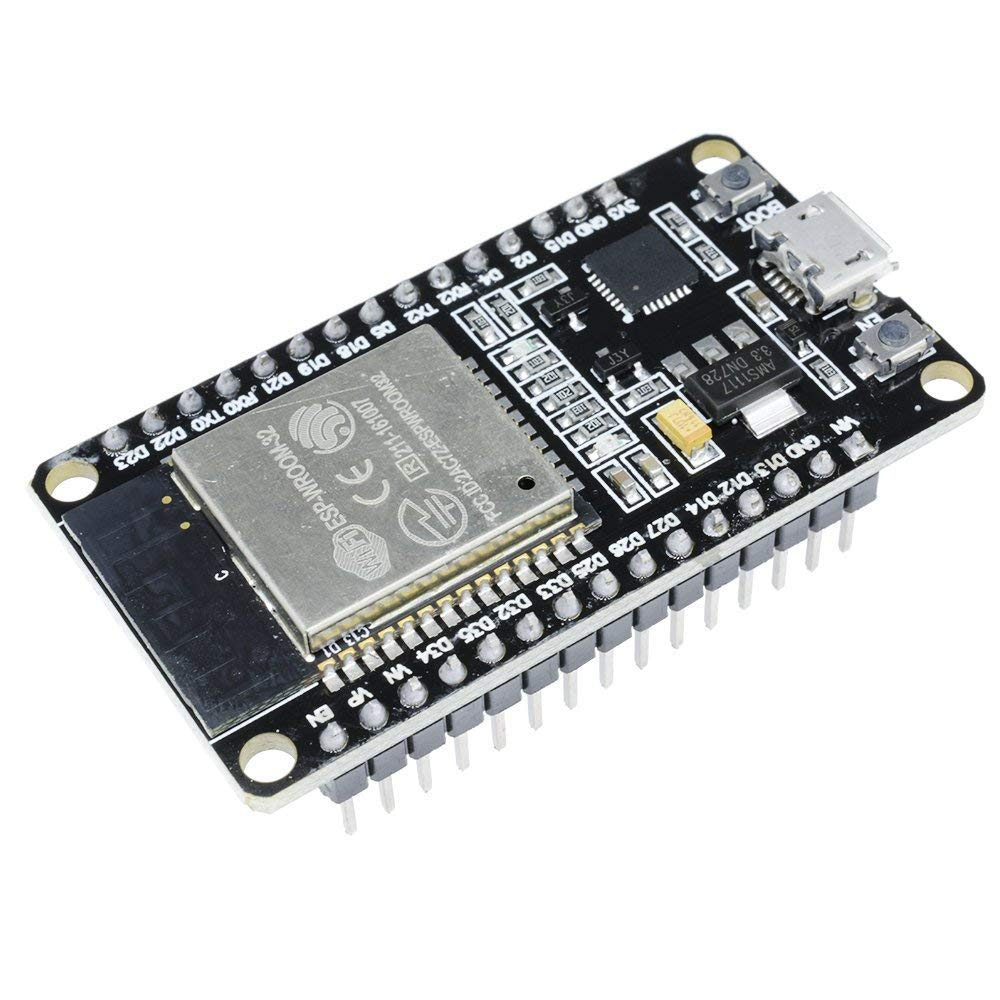

# ESP32

## Introduction 

ESP32 is a series of feature-rich MCU with integrated Wi-Fi and Bluetooth connectivity for a wide range of applications. Espressif Systems, China, produce it.ESP32 is cheap and nearly ten times faster than Arduino Uno and is a 32-bit versatile device.
Developers of ESP32 IC made a small module board with edge castellations. One popular version of such a module board is called ESP-WROOM-32. It is a dual-core, 32-bit microcontroller unit, and all the cores can be controlled individually. It has integrated Wi-Fi, Bluetooth, and Bluetooth Low Energy with multiple digital and analog I/O pins.

## Comparison Of ESP32 and Arduino Uno

| Parameter              | ESP32 | ARDUINO UNO |
|------------------------|---------------------------|-------------|
| Processor              | Xtensa dual-core             | ATMega328P  |
|Number of Cores| 2 | 1 | 
|Architecture| 32 bit | 8 bit |
| Operating Voltage|2.2 to 3.6V |5V|
|CPU Frequency|160 or 240 MHz|16 MHz|
|WiFi| YES | NO |
|Bluetooth| YES | NO |
|RAM| 512 KB | 2 KB| 
|Flash| 16 MB | 32 KB|
|GPIO pins| 36 | 14|
|Busses| SPI,I²C,UART,I2S,CAN | SPI,I²C,UART |
|ADC Pins| 18 | 6 |
|DAC Pins| 2 | 0 |
|USB Conector|Micro|Type B|
|UART|3|1|
|SPI|3|1|
|I²C|2|1|

## Pinout

You can refer to the [manual](https://www.espressif.com/sites/default/files/documentation/esp32_datasheet_en.pdf ) provided by Espressif Systems to view the complete pinout in detail.

## Peripherals and Features 

Now that we have seen the ESP32 Pinout , let us now focus on some of the important peripherals of ESP32 and their associated pins. ESP32 Microcontroller has:

* Up to 18 12-bit Analog to Digital converters.
* 2, 8-bit Digital to Analog converters.
* 10 capacitive touch switch sensors.
* 4 SPI channels.
* 2 I²C interfaces.
* 2 I2S interfaces (for digital audio).
* 3 UARTs for communications.
* Up to 8 channels of IR remote control.
* Up to 16 channels of LED PWM (pulse width modulation).
* An integrated Hall-effect sensor.
* An ultra-low-power analog preamp.
* An internal low-dropout regulator.

* ### GPIO
34 pins, each pin carries out more than one function ( only one will be active). You can configure a pin as either a GPIO or an ADC or an UART in the program.ADC and DAC pins are predefined, and you have to use the manufacturer specified pins. But other functions like PWM, SPI, UART, I2C etc. can be assigned to any GPIO pin through the program.

* ### RTC GPIO
part of the RTC Low-Power subsystem. These pins can be used to wake ESP32 from a deep sleep as an external wake-up source.

* ### ADC
ESP32 has two 12-bit SAR Analog to Digital Converter Modules with 8-channels and 10-channels each. So, ADC1 and ADC2 blocks combined together have 18 channels of 12-bit ADC.With 12-bit resolution, the Digital output values will be in the range of 0 – 4093.

* ### DAC
ESP32 Microcontroller has two independent 8-bit Digital to Analog Converter channels to convert digital values to analog voltage signals. The DAC has an internal resistor network and uses a power supply as an input reference voltage.
The following two GPIO Pins are associated with DAC functionalities.

   1. DAC1 — GPIO25
   2. DAC2 — GPIO26

* ### Capacitive Touch GPIOs
 can detect variations in capacitance on a pin due to touching or approaching the GPIO Pin with a finger or stylus. These Touch GPIOs can be used in implementing capacitive touch pads without any additional hardware.

* ### SPI
three SPI blocks (SPI, HSPI and VSPI) are present in both master and slave modes. SPI is used to interface with Flash Memory. So, you have two SPI interfaces.

* ### I²C
There are two I2C interfaces in ESP32 with complete flexibility on assigning pins, i.e., SCL and SDA pins for both I2C interfaces can be assigned in the program by the user.If you are using Arduino IDE, then the default I2C pins are:
SDA – GPIO21
SCL – GPIO22

* ### PWM
The PWM Controller in ESP32 has 16 independent PWM waveform channels with configurable frequency and duty cycle. The PWM waveform can be used to drive motors and LEDs. You can configure the PWM signal frequency, channel, GPIO pin and also the duty cycle.

## How To Program ESP32

One can use C++ and MicroPython to program the ESP32. It supports multiple programming environments :

* Arduino IDE
* PlatformIO IDE (VS Code)
* LUA
* MicroPython
* Espressif IDF (IoT Development Framework)
* JavaScript

To fully utilise the features , one must use the ESP-IDF.You can chek it out in detail [here](https://docs.espressif.com/projects/esp-idf/en/stable/esp32/index.html).

## Using the Arduino IDE 

You can program ESP32 using the Arduino IDE. You can refer to [this](https://www.electronicshub.org/esp32-arduino-ide/) tutorial to understand the complete process.

## LED Blink Sketch 

For more examples and initial projects for practice you can refer [here](https://dronebotworkshop.com/esp32-intro/ ).

## References
* [Video](https://youtu.be/xPlN_Tk3VLQ) on Introduction to ESP 32-Getting Started by DroneBot Workshop 
* For more details you can refer to the website of DroneBot Workshop [here](https://dronebotworkshop.com/esp32-intro/).
* ESP 32 [webpage](https://www.electronicshub.org/esp32-pinout/) by Electronics Hub 
* Programming Guide to ESP 32 by [Electronics Hub](https://www.electronicshub.org/esp32-arduino-ide/) and [OpenLab](https://openlabpro.com/guide/led-blinking-on-esp32/).
* Espressif Systems [documentation](https://docs.espressif.com/projects/esp-idf/en/stable/esp32/index.html)
 on ESP 32 .

