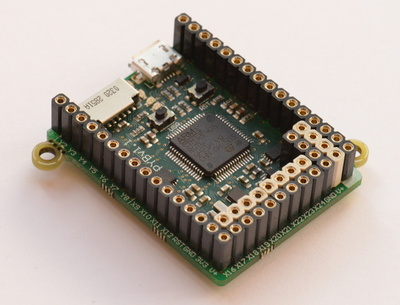
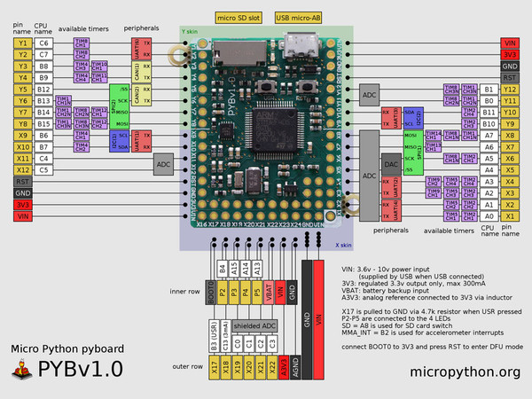

# Pyboard - MicroPython
MicroPython is an implementation of the Python 3 programming language which is optimized to run on many microcontrollers. It has modules to access the hardware of the microcontroller, and the code is compatible to a great extent with normal python code.

The Pyboard is the official MicroPython microcontroller board based on a STM3F405RG microcontroller.

<center></center>

## Pyboard Board Layout

<center></center>

The hardware has:

1. STM32F405RG microcontroller
2. 168 MHz Cortex M4 CPU with hardware floating point
3. 1024KiB flash ROM and 192KiB RAM
4. Micro USB connector for power and serial communication
5. Micro SD card slot, supporting standard and high capacity SD cards
6. 3-axis accelerometer (MMA7660)
7. Real time clock with optional battery backup
8. 24 GPIO on left and right edges and 5 GPIO on bottom row, plus LED and switch GPIO available on bottom row
9. 3x 12-bit analog to digital converters, available on 16 pins, 4 with analog ground shielding
10.	2x 12-bit digital to analog (DAC) converters, available on pins X5 and X6
11.	4 LEDs (red, green, yellow and blue)
12.	1 reset and 1 user switch
13.	On-board 3.3V LDO voltage regulator, capable of supplying up to 250mA, input voltage range 3.6V to 16V
14.	DFU bootloader in ROM for easy upgrading of firmware

## Blink Sketch

Similar to the blink sketch with Arduino, we can make a simple blink sketch with Pyboard using MicroPython.

### Code

You can copy the code from here:
```
import pyb
led = pyb.LED(4)
while True:
  led.on()
  pyb.delay(1000)
  led.off()
  pyb.delay(1000)
```
### How to Code

1.	First connect the Pyboard to your computer using a USB. It will open up as a USB flash device with a boot python file and main python file.

    There are multiple ways to code a MicroPython program and run it on Pyboard. 

2.	One beginner friendly way is to use a serial communication program like putty, which opens the interactive REPL prompt and now you can execute commands directly.
Follow this [tutorial](https://learn.adafruit.com/micropython-basics-how-to-load-micropython-on-a-board/serial-terminal) to setup putty.
    
    **NOTE:** you have to press delete after the indented at the end of the while loop to end the indented block and then only will the loop start running. To exit out of the while loop, use ctrl+c.

3.	Another way is to run scripts from the built-in file system. Write to the main python file script using any text editor, save and close it. Make sure you eject the Pyboard USB drive and then only press the reset button on the PyBoard. You can use putty as a serial monitor.

## References

1. For documentation and quick reference, check out the [official MicroPython website](https://micropython.org/).
2. For a quick introduction to MicroPython and Pyboard, check out [this](https://www.youtube.com/watch?v=5LbgyDmRu9s) video.
3. For a comparison with the Arduino, check out [this](https://www.youtube.com/watch?v=CyrgzzxQPzk) video.
4. To discuss all things related to MicroPython with an online community check out the [MicroPython Forum](https://forum.micropython.org/).