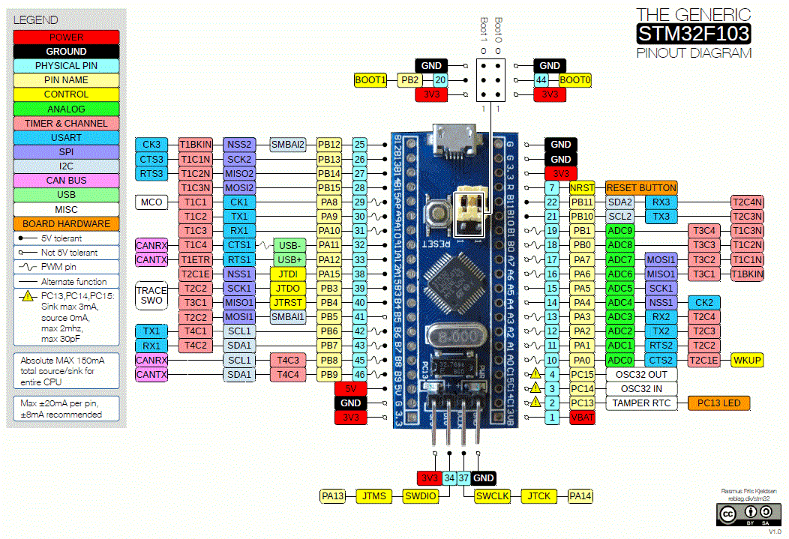

# Blue Pill (STM32F103C8T6)

## Introduction
The STM32F103C8T6 (also known as 'STM32' or 'Blue Pill") is a cheap development board based on the ARM Cortex M3 microprocessor. [This](https://www.youtube.com/watch?v=EaZuKRSvwdo) video by Great Scott can prove to be an introductory video to understand what it exactly is and how it can be used.

## Naming Convention of STM microcontrollers  
|**Parameter**|**Meaning**|
|---------|-------|
|STM| name of the manufacturer (STMicroelectronics)|  
|32| 32 bit ARM architecture | 
|F|Foundation | 
|1| Core (ARM Cortex M3)|  
|03| Line (describes peripherals and speed)  
|C| 48 pins  
|8|64 KB flash memory 
|T|LQFP package (Low Profile Quad Flat Pack)  
|6|Operating Temperature Range (-40 °C to 85 °C)  

## Technical Specifications of STM32  
|**Parameter**|**Meaning**|
|---------|-------|
|Architecture|32 bit ARM Cortex M3  
|Operating Voltage| 2.7V to 3.6V  
|CPU Frequency | 72 MHz  
|Number of GPIO pins| 37  
|Number of PWM pins| 12  
 |Analog Input Pins| 10 (12 bit resolution)  
 |I2C Peripherals| 2  
 |SPI Peripherals| 2  
 |CAN 2.0 Peripheral|1|  
 |Timers | 3(16-bit), 1| (PWM)  
 |Flash Memory| 64KB | 
|RAM| 20kB | 

For more insights about the technical specifcations refer to the [official datsheet](https://www.st.com/resource/en/datasheet/stm32f103c8.pdf) and [reference manual](https://www.st.com/content/ccc/resource/technical/document/reference_manual/59/b9/ba/7f/11/af/43/d5/CD00171190.pdf/files/CD00171190.pdf/jcr:content/translations/en.CD00171190.pdf) by STMicroelectronics.

## Pinout

## Programming STM32  
### 1) Using STM32duino bootloader (Arduino IDE) 
You can program your STM32 development board using Arduino IDE, too. You will require FTDI (USB to UART converter) for this process. [This](https://maker.pro/arduino/tutorial/how-to-program-the-stm32-blue-pill-with-arduino-ide) tutorial explains the complete process.

### 2) Using Keil UVision and STM32CubeMX
This is one step further than the last mentioned process and is more professional in terms of usage. You will require the softwares ARM's Keil Uvision and STM32CubeMX for this method of programming BluePill. You will also need the STLink/V2 which is a debugger cum programmer hardware provided by STMicroelectronics. These softwares provide a more sophisticated and professional programming environment for programming embedded systems. You may refer to [this](https://www.electronicshub.org/program-stm32f103c8t6-using-keil-uvision/) guide to know this method in detail.