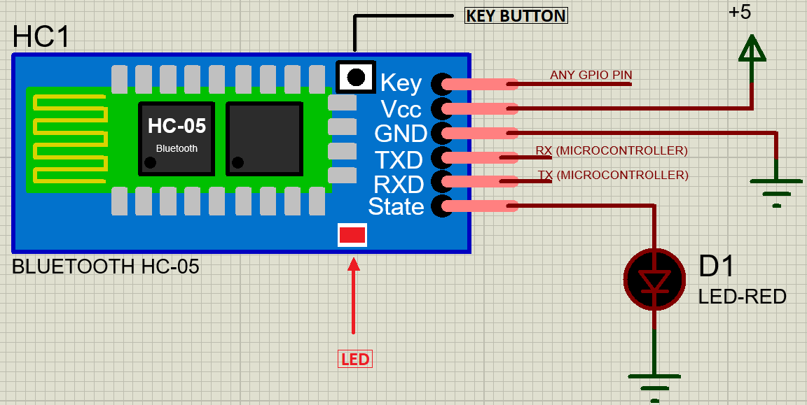
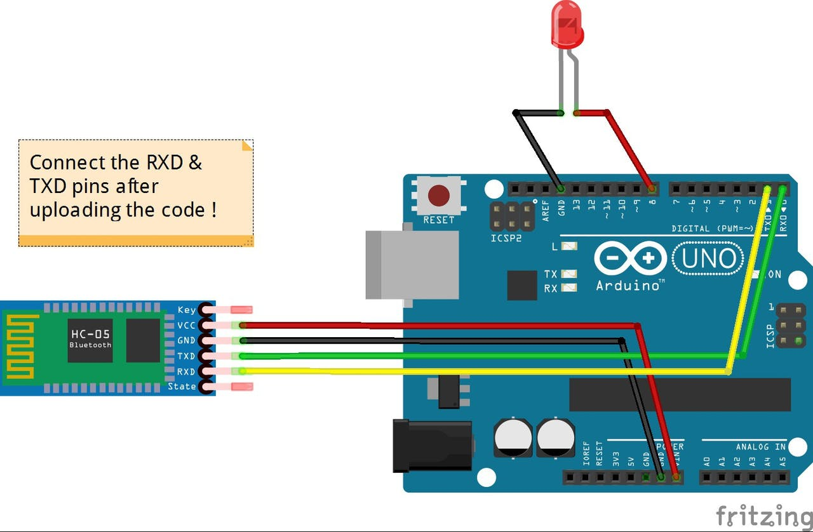

# Bluetooth Module
Bluetooth modules is one of the most used microcontrollers for data transfer in low range environment. It approximately has a range of 10 meters.HC-05 Bluetooth Module is commonly used for Bluetooth Communication. It provides wireless functionality which helps to communicate between other microcontrollers like Arduino with devices having bluetooth functionality like Phones and Laptops.
HC-05 has two operating modes, one is the Data mode wherein sending and receiving of data takes place between Bluetooth devices and the other mode is called AT Command mode wherein default device settings can be changed. These modes can be changed using the key pin, in the diagram showed below:



The connections are as follows: <br> 
Rx pin of module is connected to Tx pin of microcontroller and Tx pin of module is connected to Rx pin of microcontroller.<br>
**HC-05 Pinout Configuration:** <br>


|Pin Number|Pin Name|Description|
|---|---|---|
|1             |Enable/Key  |This pin is used to toggle between Data Mode (set low) and AT command mode (set high). By default it is in Data mode|
|2             |Vcc         |Powers the module. Connect to +5V Supply voltage|
|3             |Ground      |Ground Pin of module, connect to system ground|
|4             |TX-Transmitter|Transmits Serial Data. Everything received via Bluetooth will be given out by this pin as serial data.|
|5             |RX-Receiver |Receive Serial Data. Every serial data given to this pin will be broadcasted via Bluetooth.|
|6             |State       |The state pin is connected to on board LED, it can be used as a feedback to check if Bluetooth is working properly.|
|7             |LED         |Indicates the status of Module<br>\* Blink once in 2 sec: Module has entered Command Mode<br>\* Repeated Blinking: Waiting for connection in Data Mode<br>\* Blink twice in 1 sec: Connection successful in Data Mode|


## Bluetooth-controlled LEDs
**Components needed:-**<br>
* Arduino Board<br>
* Breadboard<br>
* Bluetooth module(HC-05)<br>
* Couple of jumpers<br>
* LEDs<br>
We also require a app named [BlueControl](https://play.google.com/store/apps/details?id=com.helektrika.bluecontrol) available on Android Playstore

**Connections:-**<br>
1. VCC of Bluetooth Module is connected to the VCC of Arduino<br>
2. GND of Bluetooth Module is connected to the GND of Arduino<br>
3. The TX pin of HC-O5 is connected to the RX pin of Arduino(Connection should not be made before uploading the code)<br>
4. The RX pin of HC-05 is connected to the TX pi nof Arduino(Connection should not be made before uploading the code)<br>
5. The positive terminal of LED is connected to any digital Pin of arduino and negative terminal to ground.<br>

**Steps:-**<br>
1. Make the connections as shown in the above image. Don’t connect the RX & TX pins WHILE/BEFORE  uploading the code !<br>

2. When you are connecting to the Bluetooth module for the first time, it will ask you the password. Enter 0000 OR 1234.<br>
3. Copy the code given below:-<br>
```cpp
void setup() {
Serial.begin(9600);
 pinMode(13, OUTPUT); // Runs the code here only once
 }
 
void loop() {
  // Repeatedly runs the code inside loop
 if(Serial.available()>0)
   {     
      char data= Serial.read(); // reads the data received from the bluetooth module
      switch(data)
      {
        case 'a': digitalWrite(8, HIGH);break; // when a is pressed on the app on your smart phone
        case 'd': digitalWrite(8, LOW);break; // when d is pressed on the app on your smart phone
        default : break;
      }
      Serial.println(data);//Publish the data on the Serial Monitor
   }
   delay(50);
}
```
**Documentation:** [Link](https://www.auselectronicsdirect.com.au/assets/files/TA0031%20BlueTooth%20HC-05%20Module.pdf)<br>
**Video Tutorial(Use of SoftwareSerial Library):** [Link](https://www.youtube.com/watch?v=coQzJGPfXnk)<br>
**Interesting Projects:**<br>
1. [Talkative Automation || Audio from Arduino || HC-05 || Voice](https://create.arduino.cc/projecthub/Vishalsoniindia/talkative-automation-audio-from-arduino-hc-05-voice-031b06?ref=tag&ref_id=hc-05&offset=6)<br>
2. [Bluetooth Door Lock](https://create.arduino.cc/projecthub/munir03125344286/bluetooth-door-lock-6e708c?ref=tag&ref_id=hc-05&offset=1)<br>
