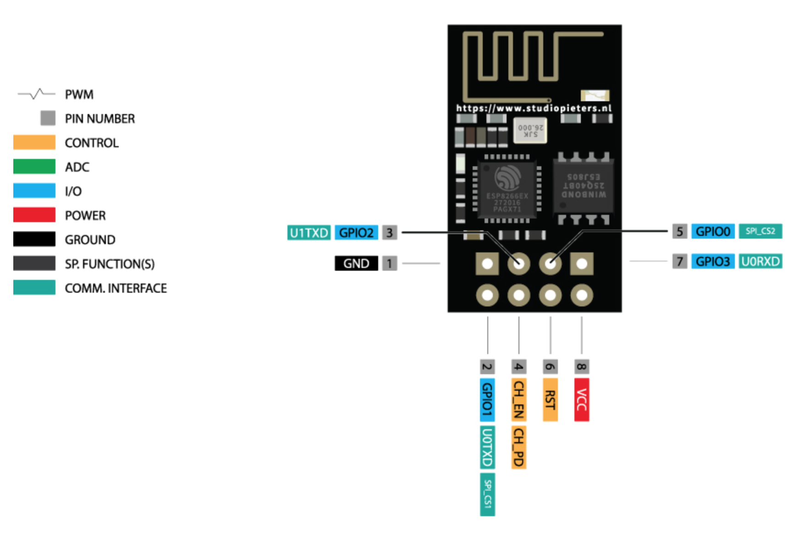
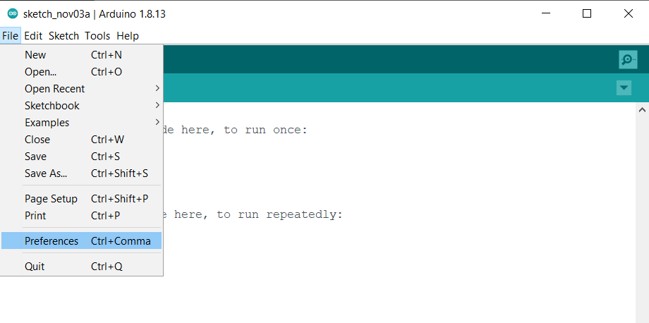
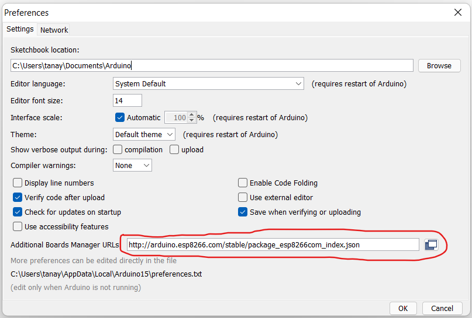
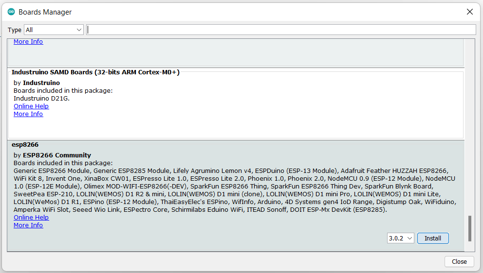
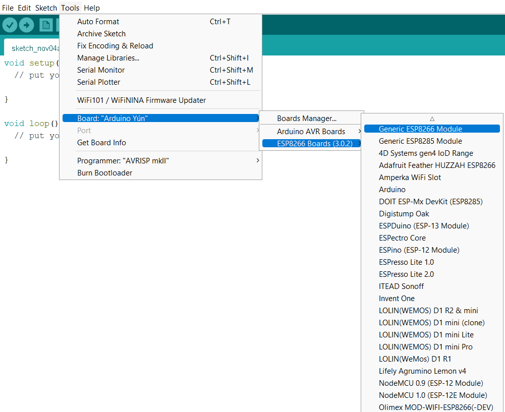
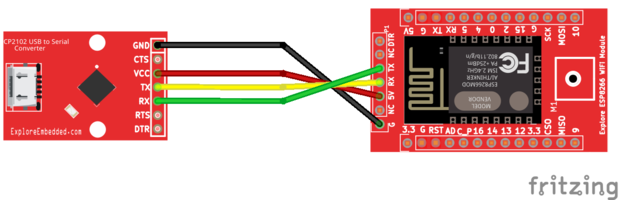

# Wi-Fi module

Wifi modules or wifi microcontrollers are used to send and recieve data over Wi-Fi. They can also accept commands over the Wi-Fi. Wi-Fi modules are used for communications bewtween devices. They are most commonly used in the field of Internet of Thnigs.

## ESP8266

ESP8266 is the most widely used Wi-Fi module. It is a low-cost microchip with a full TCP/IP stack and microcontroller capability, produced by Espressif Systems. This small module allows microcontrollers to connect to a Wi-Fi network and make simple TCP/IP connections. 

ESP8226 comes with the capabilites of:-<br>
1. 2.4 Ghz Wi-Fi<br>
2. General-purpose input/output (16 GPIO)<br>
3. Inter-Integrated Circuit (I²C) serial communication protocol<br>
4. Analog-to-digital conversion (10-bit ADC)<br>

It runs at operating voltage of 3V and can handle maximum voltage of around 3.6V. It can be easily interfaced with microcontrollers board via Serial Port. There are numerous breakout boards available based on ESP8266 Wifi Module like ESP8266 NodeMCU V3. Because of its compact size, its most importantly used in autonomous project.


### ESP8266 pinout 

<center></center>

|Pin Number|Pin Name|Working|
|-|-|-|
|1|RX |Serial Receiver Pin| 
|2|VCC|Power Pin (+3.3 V; can handle up to 3.6 V|
|3|GPIO 0|General-Purpose I/O No. 0|
|4|RST|Reset|
|5|CH_PD|Chip power-down|
|6|GPIO 2|General-purpose I/O No. 2|
|7|TX|Serial Transmitter Pin|
|8|GND|Ground|

### Scanning and dispalying available WiFi networks using ESP8266

ESP8266 comes with a built in micro-controller. It has a Arduino support and can be programmed easily. 

#### Arduino support for ESP8266

1. Download Arduino IDE from Arduino.cc(1.6.4 or greater)
> <https://www.arduino.cc/en/Main/Software>

2. Install the ESP8266 Board Package
    - Select **Preferences** under **File**
    <center></center>
    - Enter <http://arduino.esp8266.com/stable/package_esp8266com_index.json> into Additional Boards Manager URL's field under preferences.
    <center></center>
    - Select the **Board Manager** under the Tools.
    <center></center>
    - Use the **Board Manager** to install the ESP8266 package.
    <center></center>
    - Restart the Arduino IDE and Select the **Generic ESP8266 Module** board
    <center></center>

#### Connection

<center></center>

A USB to serial converter is nedded to program ESP8266. The above image shows connections made from Explore USB to Serial and Explore Wifi boards.

#### Code

```cpp
#include "ESP8266WiFi.h"
 
void setup() {
  Serial.begin(115200);
 
  // Set WiFi to station mode and disconnect from an AP if it was previously connected
  WiFi.mode(WIFI_STA);
  WiFi.disconnect();
  delay(100);
 
  Serial.println("Setup done");
}
 
void loop() {
  Serial.println("scan start");
 
  // WiFi.scanNetworks will return the number of networks found
  int n = WiFi.scanNetworks();
  Serial.println("scan done");
  if (n == 0)
    Serial.println("no networks found");
  else
  {
    Serial.print(n);
    Serial.println(" networks found");
    for (int i = 0; i < n; ++i)
    {
      // Print SSID and RSSI for each network found
      Serial.print(i + 1);
      Serial.print(": ");
      Serial.print(WiFi.SSID(i));
      Serial.print(" (");
      Serial.print(WiFi.RSSI(i));
      Serial.print(")");
      Serial.println((WiFi.encryptionType(i) == ENC_TYPE_NONE)?" ":"*");
      delay(10);
    }
  }
  Serial.println("");
 
  // Wait a bit before scanning again
  delay(5000);
}
```

### References

1. [Documentation](https://arduino-esp8266.readthedocs.io/en/latest/libraries.html#wifi-esp8266wifi-library) of ESP8266.h library.
2. [Technical Reference Manual](https://www.espressif.com/sites/default/files/documentation/esp8266-technical_reference_en.pdf) by Espressif Systems.
3. [ESP8266 Community Forum](https://www.esp8266.com/)
4. [ESP8266 for IoT guide](https://www.nabto.com/esp8266-for-iot-complete-guide/) by Nabto.