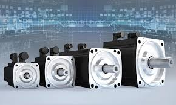
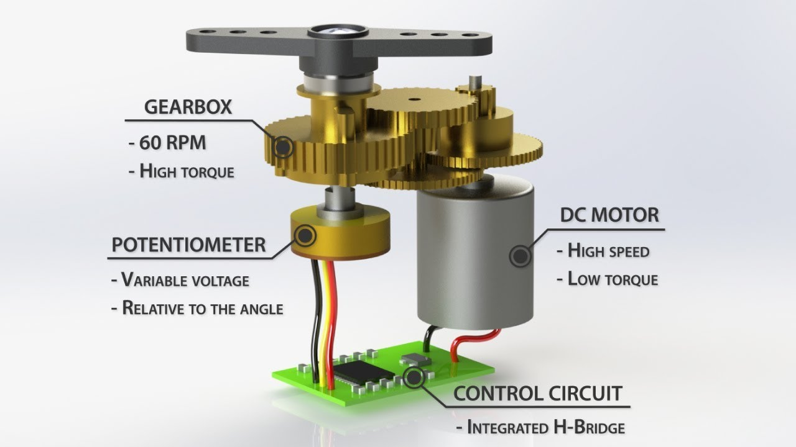
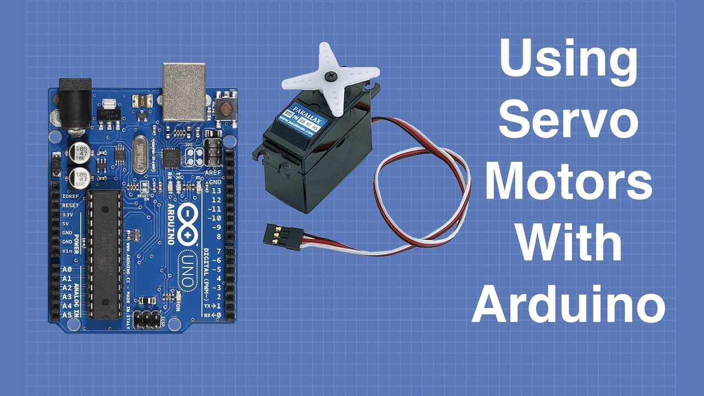
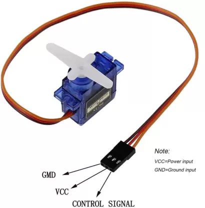

# Servo Motors

{: style="height:200px"}

Servo motors are simply just electric motors which give the users precise control over the angle of rotation, speed and torque of the motor. The shaft of a servo motor can be made to rotate by a certain angle and then it waits till the next signal is given to it. Moreover, the speed and torque, and in certain applications, even the sense of rotation of the motor can be adjusted by changing the command signal given to the motor. Whereas on the other hand, this is not possible in a simple electric motor, as it runs at a constant speed in the same direction as long as it is connected to a constant power supply. Apart from increased control, servo motors also provide high precision owing to its working principle - the servomechanism.

## What is Servomechanism ?

{: style="height:200px"}

Servomechanism is a closed loop control system which aims at achieving a fixed value of the output based on the given command, without using a variable input signal. It works by calculating the difference between the reference input signal or the command signal and the output signal received from a sensor. The feedback signal thus obtained, acts as the input signal for the device to be controlled. Hence, with the help of this feedback mechanism, we can make the output equal the reference input without having to alter the reference input manually at regular intervals. Once the output signal becomes equal to the command signal, the feedback signal goes to zero and hence the process stops till a new command signal is given.

## Working of a Servo motor

A servo motor construction consists of a simple electric motor, some gears, a potentiometer/encoder/resolver, an error detector amplifier, and a control circuit. 

{: style="height:300px"}

Potentiometers, encoders and resolvers all perform the same function by acting as sensors that measure the rotary position of the motor shaft. There are however certain differences in the way they function. If interested, you can take a look at these resources which give a detailed comparison between 

- [Potentiometer](https://www.arrow.com/en/research-and-events/articles/encoder-vs-potentiometer-how-to-choose) [and](https://www.arrow.com/en/research-and-events/articles/encoder-vs-potentiometer-how-to-choose) [Encoder](https://www.arrow.com/en/research-and-events/articles/encoder-vs-potentiometer-how-to-choose)
- [Encoder](https://www.motioncontroltips.com/faq-why-are-so-many-designers-replacing-resolvers-with-encoders/) [and](https://www.motioncontroltips.com/faq-why-are-so-many-designers-replacing-resolvers-with-encoders/) [Resolver](https://www.motioncontroltips.com/faq-why-are-so-many-designers-replacing-resolvers-with-encoders/)

Let us consider the simple case of a potentiometer used in the servo motor to clearly understand its working. 
The potentiometer gives the output reference signal by sensing the position of the shaft, hence its knob is positioned such that it does not produce any signal in the initial condition. Now, the command signal, i.e. the input reference signal,  is introduced. This command signal represents how much we want the motor shaft to rotate. Next, the input reference signal and the output reference signal are fed into the error detector amplifier, where their difference is amplified and then generated as the output. This output from the amplifier acts as the input signal for the servo motor, which now starts rotating. The knob of the potentiometer is linked to the motor shaft with the help of a gear arrangement. Thus, as the shaft rotates, the knob of the potentiometer also rotates in a way such that the difference between the input and output reference signals decreases until it becomes zero. When the difference becomes zero, the output of the amplifier also goes to zero and no input signal will be given to the motor, due to which it stops rotating. Now it will remain in this condition until a new command signal is given, so that it generates a difference with the output from the potentiometer, and the process is repeated again.

## Applications of Servo motors and Their Types

Servo motors have a wide variety of applications ranging from RC toys to industrial machines. Hitec and Futaba are the leading RC servo manufacturers and you can easily buy these online. 
Servo motors are built in cameras to adjust the focus of the lens. They are even found in DVD players, where they are used to open/close the disk tray. Due to their high precision and ability to rotate by a desired angle, they are also used in cutting machines such as the milling machine. Servo motors also find numerous applications in the field of robotics, where they are actively being used for making mobile robots as well as to make movable joints in robotic arms which require highly accurate movements. 

{: style="height:300px"}

Depending upon their application, there are different types of servo motors. You can check out this [website](https://robu.in/types-of-servo-motor/) to know more on this.

## Arduino and the Servo motor

{: style="height:200px"}

Now that we have a good idea about what a servo motor is, how it works and where it is being used, let’s get our hands dirty and understand how we can control a servo motor using an Arduino !

The first step is to connect the motor to the Arduino board. A typical servo motor has three wires : the black/brown ground wire, which should be connected to the ground of the Arduino ; the red power cable, which should be connected to the 5 V on the Arduino ; and finally a yellow/orange wire, which should be connected to any PWM digital pin (the ones marked with a tilde) on the Arduino.

{: style="height:300px"}

NOTE : If you have a servo that consumes more than 250mA, consider using a separate power supply for your servo, instead of the 5 V of the Arduino.

So we have successfully connected the servo to our Arduino, but how do we make it work ? Not to worry ! Arduino has a Servo library which has various methods that can make our life easier.

Let us now take a look at some of the commonly used methods of the Arduino Servo library and their uses:-

-    attach() - Attach the Servo variable to a pin.
-    write() - Writes a value to the servo, controlling the shaft accordingly.
-    writeMicroseconds() - Writes a value in microseconds (us) to the servo, controlling the shaft accordingly.
-    read() - Read the current angle of the servo ( the value passed to the last call to write() ).
-    attached() - Check whether the Servo variable is attached to a pin.
-    detach() - Detach the Servo variable from its pin.

For the complete documentation with syntax and relevant examples, you can check out this [link](https://www.arduino.cc/reference/en/libraries/servo/).

If you wish to refer to some basic code examples to get started with using a servo motor with an Arduino, these websites might be helpful : ( [1](https://www.instructables.com/Arduino-Servo-Motors/) and [2](https://lastminuteengineers.com/servo-motor-arduino-tutorial/) ).
