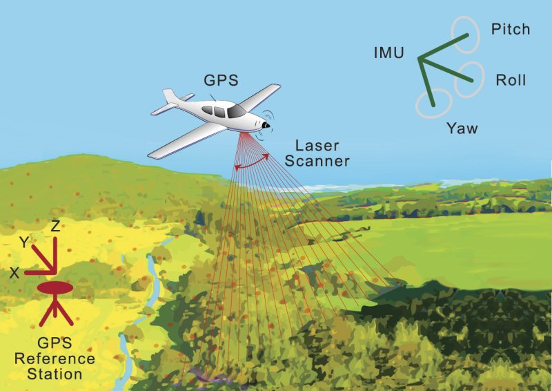
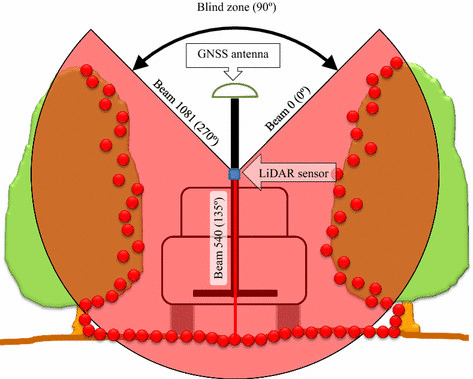
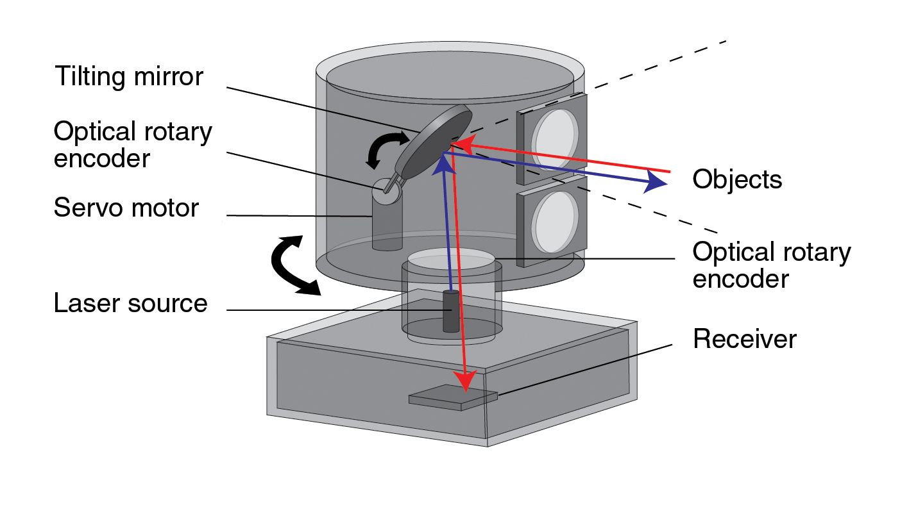

# Lidar

Lidar is a method for calculating distances between objects with the help of a laser and measuring the amount of time taken for the reflected light to return back.

## Lidar Sensor

A Lidar sensor emits pulsed light waves into the surrounding environment. These pulses bounce off of    obstacles and the surrounding environment and then return to the sensor. The sensor then, keeps a track of time it took for the light to bounce off and thus calculating the distance between obstacles. Repeating this process constantly creates a real-time map of the environment.

<center>{: style="height:350px"}</center>

As an example of how a lidar sensor calculates the distance between the sensor and an obstacle,

Let's define the following variables,
1) Speed of light, $c = 3 × 10^8 m/s$
2) time taken for light to travel from the lidar sensor, hitting the obstacle and returning back to the sensor, $t$
3) Distance between the obstacle and the sensor, $d$

Say that the time taken, $t = 5 × 10^{-8} sec$ (Observe the order of magnitude $t$)

So, to calculate the distance $d$, we use the Newton's second law of motion

$$ S = u \cdot t + \frac{1}{2} \cdot a \cdot t^2 $$

Since, speed of light constant, replacing, $a = 0$, $u = c$, and, $S = d$  we get,

$$ d = c \cdot t $$

$$ d = 3 × 10^8 × 5 * 10^{-8} $$

$$ d = 15m $$

Therfore, the distance between the sensor and the obstacle is calculated to be 15 meters. This is the basic calculation that goes into calculating the distances.

### Types of Lidar Systems

1) Airborne Lidar - This is installed on aerial drones or vehicles like helicopters. It emits light towards the ground surface giving a fairly detailed and quick map of the terrain above which the vehicle or drone is flying. It is also used for topographic survey.

<center>{: style="height:200px"}</center>

2) Terrestrial Lidar - This is generally installed on vehicles moving on the earth's surface. These give a detailed map, and can be used to make a robot or a vehicle navigate through it's evironment. It is also used for observing highways, roads and infrastructure.

<center>{: style="height:200px"}</center>


### Components of a basic Lidar Sensor

<center>{: style="height:350px"}</center>

A lidar sensor generally consists of 4 main components: 
1) Light source - Generally a laser (or anything that emits light in pulses)
2) Optical components - There are multiple optical components for example, the light through the sensor, falls on a rotating/oscillating mirror so as to change the direction of light to cover a 360 view. An optical lens helps to focus light on the photodetector.
3) photodector - The light is recieved by this photodetector and the signal is processed electronically like frequency of light (for speed measurements) and the time taken for the light to bounce.
4) GPS - These sensors need a GPS system to determine the exact position and orientation of the sensor in 3D space.

For a more indepth explaination of a Lidar sensor and the different factors that go into designing one, for example, the wavelength of light to use, the pulsing rate of the light or pulse repetition rate and more factors can be found [here.](https://www.newport.com/n/lidar)

## Lidar usage

To implement Lidar into your ros program, these are the following steps you must follow:
* Connect your Lidar sensor to a power supply, and connect a data transmitter to the Lidar sensor and the computer.
* You need to give permissions to the on data input port of the computer. To check the permissions, type
```bash
ls -l /dev/tty
```
* If your permissions are set properly, you should get an output like shown below. Just focus on the starting part, ```crw-rw-rw```. If instead, it is something of the form ```crw-rw--```, then your permissions are not set properly.
```bash
crw-rw-rw- 1 root dialout 5, 0 Sep  6 23:50 /dev/ttyACM0
```
* To set permissions, (replace ```ACM0``` with whatever your ports are)
```bash
sudo chmod a+rw /dev/ttyACM0
```
* Next, you need to download the package of your Lidar manufacturer. Following are the common packages and their github links. You need to clone these github repositories in the src directory of your catkin workspace.

    1) [Slamtec](https://github.com/Slamtec/rplidar_ros)
    2) [YDLiDAR](https://github.com/EAIBOT/ydlidar)
    3) [Hokuyo](https://github.com/ros-drivers/urg_node)
    4) [ROS SICK](https://github.com/SICKAG/sick_scan)
    5) [ROS2 SICK](https://github.com/SICKAG/sick_scan2)
    6) [RoboSense](https://github.com/RoboSense-LiDAR/rslidar_sdk)
* After you have cloned the ros packages, go into your workspace directory,
```bash
catkin_make
source devel/setup.bash
```
* Now just run the launch file according to your Lidar manufacturer package. For the above 6 manufacturers, run the following launch files. (If you are getting package not found error, please give appropriate permissions to the launch files using chmod).

    1) Slamtec
        ```bash
        roslaunch rplidar_ros rplidar.launch
        ```
    2) YDLiDAR
        ```bash
        roslaunch ydlidar lidar_view.launch
        ```
    3) Hokuyo
        ```bash
        roslaunch urg_node urg_lidar.launch
        ```
    4) ROS SICK - Read the README file in the [github repo](https://github.com/SICKAG/sick_scan) for which launch file you need for your specific model.

    5) ROS2 SICK - Read the README file in the [github repo](https://github.com/SICKAG/sick_scan2) for which launch file you need for your specific model.

    6) RoboSense
        ```bash
        roslaunch rslidar_sdk start.launch
        ```

For a much more detailed guide, use [this link.](https://www.generationrobots.com/blog/en/lidar-integration-with-ros-quickstart-guide-and-projects-ideas) This shows a fairly detailed explaination on how to setup your lidar to interact with ROS and display the results in rviz. It also has some examples of implementation and different repositories that would help you to code.

You can also check out [this link](https://maker.pro/ros/tutorial/how-to-use-a-lidar-sensor-with-robot-operating-system-ros) which provides a simple explaination for setting up a YDLiDAR X4 Sensor.

## Applications of Lidar

1) Surveying land - Lidar sensors can generate a cost effective solution for generating a 3D digital terrain model of remote or rough areas which are difficult to assess otherwise. (Nasa used Lidar techonology to explore mars). For more information on Airborne Lidar and Topographic survey, check out [this research paper](https://www.isprs.org/proceedings/XXXVII/congress/3b_pdf/50.pdf).
2) Power line inspection - Power lines span very long distances and thus make the inspection of power lines very difficult. Lidar sensors can make the inspection easier, by identifying faults before they can cause any real damage.
3) Farming and Forest research - These can be deployed to large farms to help determine how to use resources in an efficient manner and boost productivity. They can also be used to research on the impact that humans have caused on natural life in forests, as Lidar sensors can penetrate tree cover.
4) Climate and weather change - Climate scientists use Lidar to study and track changes in the atmosphere. Lidar can also be used to warn people if there is a Tsunami incoming.
5) Robotics - Lidar is used to equip robots with Mapping and navigational capabilities. For example, self driving cars.

## Companies working on Lidar technologies

1) [tuSimple](https://www.tusimple.com/) - works on self driving cars which is almost commercial ready.
2) [AEye](https://www.aeye.ai/) - Develops advanced vision hardware, software and algorithms for autonomous vehicles.
3) [SiLC Technologies](https://www.silc.com/) - Is a leading provider of highly integrated FMCW (Frequency Modulated Continuous Wave) Lidar solutions, which include their FMCW integration chip.

## References - 

* George, N., 2021. 11 Interesting LiDAR Applications. [online] Blog.cloudfactory.com. Available at: <https://blog.cloudfactory.com/interesting-lidar-applications> [Accessed 7 September 2021].

* Geospatial World. 2021. What is LiDAR technology and how does it work?. [online] Available at: <https://www.geospatialworld.net/blogs/what-is-lidar-technology-and-how-does-it-work/> [Accessed 7 September 2021].

* Microdrones.com. 2021. 5 Compelling Applications for LiDAR Technology. [online] Available at: <https://www.microdrones.com/en/content/5-compelling-applications-for-lidar-technology/> [Accessed 7 September 2021].

* Sentech. 2021. The revealing science behind Lidar technology. [online] Available at: <https://www.sentech.nl/en/sensor-technology/revealing-science-behind-lidar-technology/> [Accessed 7 September 2021].

* Velodyne Lidar. 2021. What is Lidar? Learn How Lidar Works | Velodyne Lidar. [online] Available at: <https://velodynelidar.com/what-is-lidar/> [Accessed 7 September 2021].


