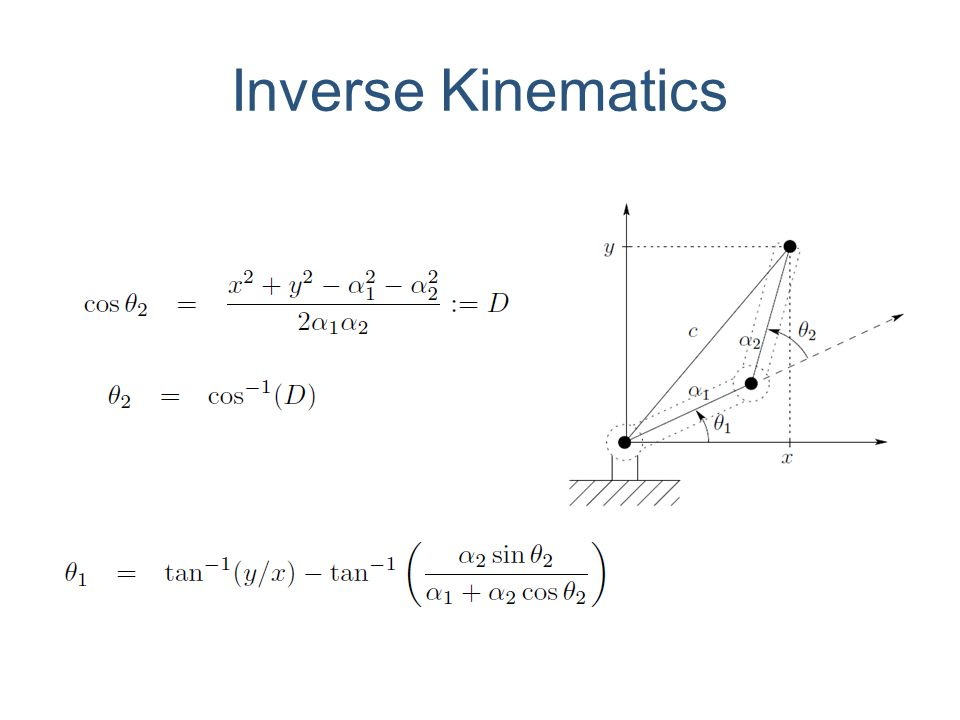

# Forward Kinematics

The forward kinematics problem for a serial-chain manipulator is to find the position and orientation of the end-effector relative to the base given the positions of all of the joints and the values of all of the geometric link parameters. Often, a frame fixed in the end-effector is referred to as the tool frame, and while fixed in the final link N, it in general has a constant offset in both position and orientation from frame N. Likewise, a station frame is often located in the base to establish the location of the task to be performed. This frame generally has a constant offset in its pose relative to frame 0, which is also fixed in the base. In practice, the forward kinematics problem is solved by calculating the transformation between a coordinate frame fixed in the end-effector and another coordinate frame fixed in the base, i.e., between the tool and station frames. This is straightforward for a serial chain since the transformation describing the position of the end-effector relative to the base is obtained by
simply concatenating transformations between frames fixed in adjacent links of the chain.

{: style="height:500px align=centre"}

# Inverse Kinematics

The inverse kinematics problem for a serial-chain manipulator is to find the values of the joint positions given the position and orientation of the end-effector relative to the base and the values of all of the geometric link parameters. Once again, this is a simplified statement applying only to serial chains. A more general statement is: given the relative positions and orientations of
two members of a mechanism, find the values of all of the joint positions. This amounts to finding all of the joint positions given the homogeneous transformation between the two members of interest. When solving the inverse problem, we often have to choose one solution from a number of valid solutions. There are also degenerate cases with an infinite number of solutions Some solutions of the inverse mapping may not be physically realizable. This is due to manipulators having physical joint limits that prevent the mechanism from achieving certain joint configurations that may be solutions to the inverse kinematics problem (e.g. a joint may not have a full 360 degree motion)

{: style="width:500px"}

{: style="width:500px"}

To get a more detailed idea of solving inverse and forward kinematics problems for robotic system do checkout this 3 part video series from milfordrobotics

[Part-1](https://www.youtube.com/watch?v=VjsuBT4Npvk),
[Part-2](https://www.youtube.com/watch?v=3ZcYSKVDlOc&t=683s),
[Part-3](https://www.youtube.com/watch?v=llUBbpWVPQE)