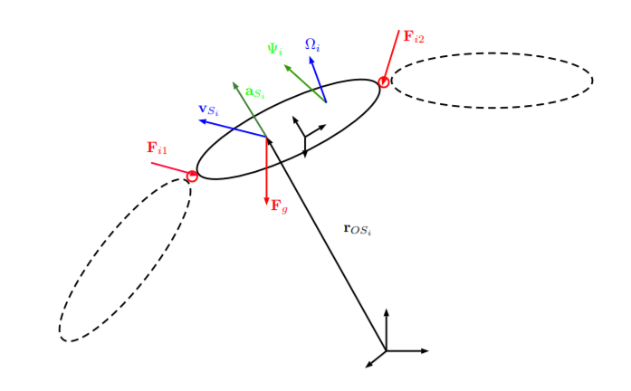

# Introduction to Dynamics

For many applications with fixed-based robots we need to find a multi-body dynamics formulated as:

$$ M(q)\ddot{q} + b(q,\dot{q}) + g(q) = \tau \: + J_{c}(q)^{T}F_{c} $$

consisting of the following components:

$M(q)$      $\epsilon$   $\mathbf{R}$ $^{n_{q}Xn_{q}}$  Generalized Mass matrix(orthogonal)

$q, \dot{q}, \ddot{q}$     $\epsilon$   $\mathbf{R}^{n_{q}}$        Generalized position, velocity and acceleration vectors

$b(q, \dot{q})$    $\epsilon$   $\mathbf{R}^{n_{q}}$        Coriolis and centrifugal terms.

$g(q)$        $\epsilon$   $\mathbf{R}^{n_{q}}$        Gravitational terms.

$\tau$             $\epsilon$   $\mathbf{R}^{n_{q}}$        External generalized forces.

$F_{c}$          $\epsilon$   $$\mathbf{R}^{n_{q}}$         External Cartesian forces (e.g. from contacts)

$J_{c}(q)$     $\epsilon$     $\mathbf{R}^{n_{q}Xn_{q}}$    Geometric Jacobian corresponding to the external forces.

Different methods exist to compute the so-called Equations of Motion (EoM) of a given system, i.e., a closed-form mathematical model of the system dynamics. The two most common methods used in robotics are Newton-Euler method which essentially applies the principles of conservation of linear and angular momentum for all links of a robot and Lagrange Method which utilizes scalar energy-based functions over the the space of generalized coordinates which adhere to certain minimization principles, thus resulting in trajectories which automatically satisfy the kinematic constraints of the system.

to understand better how problems related to dynamics in robotics are tackled do give a watch to this [lecture](https://www.youtube.com/watch?v=B67ug1yx13E) on robot dynamics by IIT KGP Prof. Dilip Kumar Pratihar  

## Newton-Euler Method

### Newton-Euler for Single Bodies

a very well known formulation formed by Newton and Euler using law of angular and linear momentum is :

​                                                                       $\dot{\mathsf{p}} _{S}$ = $F_{ext,S}$

​                                                                       $\dot{\mathbf{N}}_{S}$ = $T_{ext}$

where $F_{ext,S}$ are the resultant external forces that act through the COG and  $T_{ext}$ are the resultant external torques. External forces which do not act through the COG need to be shifted to an equivalent force/moment pair of which the force acts through the COG.

### Newton-Euler for Multi-Body Systems

When dealing with multi-body systems, a valid approach is to separate all bodies at the joints as depicted in and to consider every body as a single unit. Thereby, the constraint forces F$_{i}$ at the joints must be introduced as external forces acting on each of the bodies when cut free. For all these bodies, we must then apply conservation of linear and angular momentum in all DoFs, subject to external forces (which now include the joint forces F$_{i}$ , too). For a general 3D case and a fixed base, this results in a 6$n_{j}$ -dimensional systems of equations. Additionally, there are 5 $n_{j}$ motion constraint due to the ideal joints. They ensure that the two connected bodies only move along the direction of the joint but don’t move in all other directions that are blocked by the joint.

{: style="height:350px align=centre"}

## Lagrange Method

 This method is centered around three fundamental concepts:

1. The definition of generalized coordinates$ q$ and generalized velocities $\dot{q}$ , which may or may not encode the information regarding the constraints applicable to the system.

2. . A scalar function called the Lagrangian function $\mathcal{L}$. For mechanical systems, it is exactly the difference between the total kinetic energy $\mathcal{T}$ and the total potential energy $\mathcal{U}$, of the system at each instant:

   ​                                                         $\mathcal{L} = \mathcal{T} - \mathcal{U}$

3. The so-called Euler-Lagrange equation, also known as the Euler-Lagrange of the second kind, which applies to the Lagrangian function $\mathcal{L}$ and to the total external generalized forces $\tau$ :

   ​                                            $\frac{d}{dt} (\frac{\partial{\mathcal{L}}}{\partial{\dot{q}}} )$  -  $(\frac{\partial{L}}{\partial{\dot{q}}})$      =   $\tau$

   In the most general case, the Lagrangian is a function of the generalized coordinates and velocities q and q˙ , and it may also have an explicit dependence on time t, hence we redefine the aforementioned scalar energy functions as $\mathcal{T} = \mathcal{T}(t, q, \dot{q})$ and $\mathcal{U} = \mathcal{U}(t,q)$, thus $\mathcal{L} = \mathcal{L}(t,q,\dot{q})$ .

   In the end, one of the most notable properties of this formulation is the capacity to eliminate all internal reaction forces of the system from the final EoM, in contrast to the Newton-Euler formulation where there they are explicitly accounted for.

   To get a more detailed insight on how to formulate Newton-Euler equation and Lagrange equation  for different robot system check out this [lecture](https://youtu.be/xc71IuDmZIw) by IIT Delhi prof S.K SAHA

   some of the other resources you can checkout to know more about kinematics and dynamics involved in robotics are:

   1. A Mathematical Introduction to Robotic Manipulation by Richard Murray
   2. Robot dynamics and control by Mark Spong
   3. Springer Handbook on Robotics by Oussama Khatib