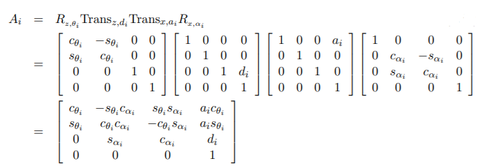

# Joint Kinematics

The links that compose the robotic mechanism are assumed to be perfectly rigid bodies having surfaces that are geometrically perfect in both position and shape. Accordingly, these rigid bodies are connected together at joints where their idealized
surfaces are in ideal contact without any clearance between them. The respective geometries of these surfaces in contact determine the freedom of motion between the two links, or the joint kinematics.

### Revolute

The most general form of a revolute joint, often abbreviated as R and sometimes referred to colloquially as a hinge or pin joint, is a lower pair composed of two congruent surfaces of revolution. The surfaces are the same except one of them is an external surface, convex in any plane normal to the axis of revolution, and one is an internal surface, concave in any plane normal to the axis. The position of one body relative to the other may be expressed as the angle between two lines normal to the joint axis, one fixed in each body. Thus, the joint has one degree of freedom (DOF).

### Prismatic

The most general form of a prismatic joint, often abbreviated as P and sometimes referred colloquially as a sliding joint, is a lower pair formed from two congruent general cylindrical surfaces. A prismatic joint permits only sliding of one of the members joined relative to the other along the direction of extrusion. The position of one body relative to the other is determined by the distance between two points on a line parallel to the direction of sliding, with one point fixed in each body. Thus, this joint also has one degree of freedom.

### Helical

The most general form of a helical joint, often abbreviated as H and sometimes referred to colloquially as a screw joint, is a lower pair formed from two helicoidal surfaces formed by extruding any curve along a helical path. The simple example is a bolt and nut wherein the
basic generating curve is a pair of straight lines.

Other types of joints include Planar, [Spherical](https://www.sciencedirect.com/topics/engineering/spherical-joint), [Cylindrical](https://en.wikipedia.org/wiki/Cylindrical_joint), etc.

## 6-DOF Joint

The motion of two bodies not jointed together can be modeled as a six-degree-of-freedom joint that introduces no constraints. This is particularly useful for mobile robots, such as aircraft, that make at most intermittent contact with the ground, and thus, a body in free motion relative to the fixed frame is termed a floating base. Such a free motion joint model enables the position and orientation of a floating base in space to be expressed with six joint
variables.

# Geometric Representation

The geometry of a robotic mechanism is conveniently defined by attaching coordinate frames to each link. While these frames could be located arbitrarily, it is advantageous both for consistency and computational efficiency to adhere to a convention for locating the frames on the links. A commonly used convention for selecting frames of reference in robotic applications is the Denavit-Hartenberg, or D-H convention. In this convention, each homogeneous transformation $A_{i}$ is represented as a product of four basic transformations

{: style="height:250px"}

where the four quantities $\theta_{i} , a_{i} , d_{i} , \alpha_{i}$ are parameters associated with link i and joint i. The four parameters $a_{i} ,\alpha_{i} ,d_{i} , and \: \theta_{i}$ in are generally given the names link length, link twist, link offset, and joint angle, respectively, three of the above four quantities are constant for a given link, while the fourth parameter, $\theta i$ for a revolute joint and $d_{i}$ for a prismatic joint, is the joint variable.

Check out this [video](https://www.youtube.com/watch?v=FiKEAdednuo) to know more about how to use DH parameters for geometric representation or go [here](https://robotacademy.net.au/lesson/denavit-hartenberg-notation/) for know about DH notation in more detail.

{: style="height:350px align:center"}
