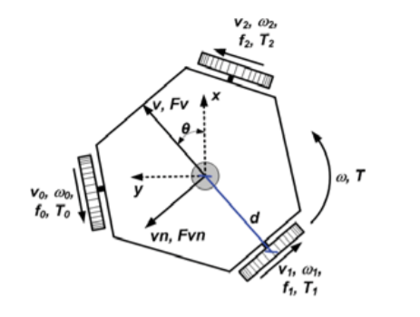
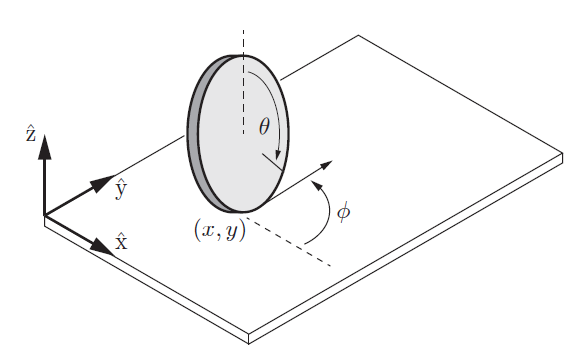
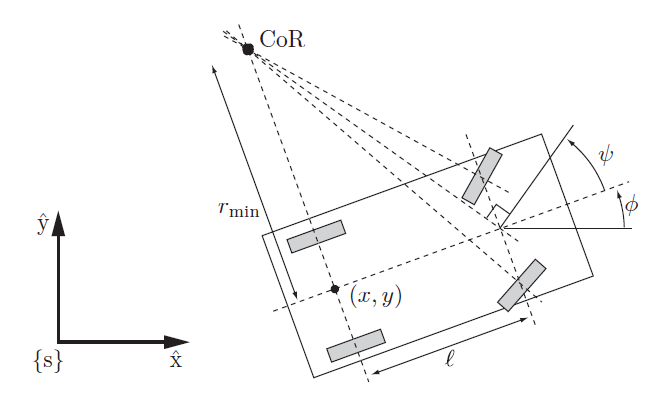

# Drive Mechanism

Wheeled mobile robots may be classified in two major categories, omnidirectional and nonholonomic.

**Omnidirectional wheeled mobile robots** typically employ either omniwheels or mecanum wheels. An omniwheel is a typical wheel augmented with rollers on its outer circumference. These rollers spin freely about axes in the plane of the wheel and tangential to the wheel's outer circumference, and they allow sideways sliding while the wheel drives forward or backward without slip in that direction. Mecanum wheels are similar except that the spin axes of the circumferential rollers are not in the plane of the wheel. The sideways sliding allowed by omniwheels and mecanum wheels ensures that there are no velocity constraints on the robot's chassis.

**Nonholomic wheeled robots** are subject to a single Pfaffian velocity constraint i.e. they cannot move sideways or parallel to the axis of the axel. Example for a nonholomic wheeled robot is a car and despite this velocity constraint, a car can reach any $(\phi,x,y)$ configuration in an obstacle-free plane. In other words, the velocity constraint cannot be integrated to an equivalent configuration constraint, and therefore it is a nonholonomic constraint.

If we want to prescribe the robot’s movements in the environment, we need to know how the robot variables relate to the primary variables we can control: the angular positions and velocities of the wheel shafts. Therefore, a kinematical model of the robot has to be developed.

## Modeling of an Omnibase Robot

Generally Omni wheeled robots use either a three wheeled platform or a four wheeled platform. Each design has its own advantages and disadvantages. In a three wheel design, wheels are at $120^{\circ}$ from each other and they offers greater traction as any reactive force is distributed through only three points and the robot is well balanced even on uneven terrain.

The configuration of a robot is defined in the form $q = (x,y,\theta)$, $d$ is the distance between wheels and the center of the robot $v_i$ and $\omega_i$ are the linear and angular velocity of the $i^{th}$ wheel respectively. $v, v_n$ are the two components of the linear velocity of the robot and $\omega$ is the angular velocity. The well known kinematic model of an omnidirectional robot located a $(x,y,\theta)$ can be written as $v_x(t) = dx(t)/dt , v_y(t) = dy(t)/dt$ and $\omega(t) = d\theta(t)/dt$. For a three wheeled robot

$$ \begin{bmatrix} v_0(t)\\ v_1(t)\\ v_2(t) \end{bmatrix} = \begin{bmatrix} -sin\pi/3 & cos\pi/3 & d\\ 0 & -1 & d\\ sin\pi/3 & cos\pi/3 & d \end{bmatrix} \begin{bmatrix} v(t)\\ v_n(t)\\ \omega(t) \end{bmatrix} $$

Applying the inverse kinematics is possible to obtain the equations that determine the robot speeds related the wheels speed. Solving in order of $v$, $v_n$ and $\omega$, the following can be found

$$ v(t) = (\sqrt{3}/3)(v_2(t) - v_0(t))\]
\[v_n(t)=(1/3)(v_2(t) +v_0(t))−(2/3)v_1(t)\]
\[\omega(t)=(1/(3d))(v_0(t) +v_1(t) +v_2(t)) $$

## Modeling of a Nonholomic Robot

A nonholomic robot is modelled in differnet ways which will then dictate the drive mechanism that can be applied on the robot. Differnet drive mechanism and modelling for a nonholomic robot are:

*  Unicycle model
*  Differential Drive
*  Ackermann Steering

### Unicycle Model

The simplest wheeled mobile robot is a single upright rolling wheel, or unicycle. The configuration of a robot with a wheel of radius $r$ can be written in the form $q = (\phi,x,y,\theta)$, where $(x,y)$ is the contact point, $\phi$ is the heading direction, and $\theta$ is the rolling angle of the wheel. The kinematic equations can be written as

$$ \dot{q} = \begin{bmatrix} \dot{\phi}\\ \dot{x}\\ \dot{y}\\ \dot{\theta} \end{bmatrix} = \begin{bmatrix} 0 & 1\\ rcos\phi & 0\\ rsin\phi & 0\\ 1 & 0 \end{bmatrix}  \begin{bmatrix} u_1\\ u_2 \end{bmatrix} = G(q)u = g_1(q)u_1 + g_2(q)u_2 $$

The control inputs are $u = (u_1,u_2)$, with $u_1$ the wheel's forward-backward driving speed and $u_2$ the heading direction turning speed.

Three things to notice about these models are: (1) there is no drift - zero controls mean zero velocity; (2) the vector fields $g_i(q)$ are generally functions of the configuration $q$; and (3) $\dot{q}$ is linear in the controls.

### Differnetial Drive

A differential drive is the most basic drive, which consists of two sets of wheels that can be driven independently. This is the most commonly used form of locomotion system used in robots as it’s the simplest and easiest to implement.

A differential drive robot consists of two independently driven wheels of radius $r$ that rotate about the same axis, as well as one or more caster wheels, ball casters, or low-friction sliders that keep the robot horizontal. If both the wheels are driven in the same direction and speed, the robot will go in a straight line.

If both wheels are turned with equal speed in opposite directions, as is clear from the diagram shown, the robot will rotate about the central point of the axis. Otherwise, depending on the speed of rotation and its direction, the center of rotation may fall anywhere on the line defined by the two contact points of the tires.

Let the distance between the driven wheels be $2d$ and choose the $(x,y)$ reference point halfway between the wheels. Writing the configuration as $q = (\phi,x,y,\theta_L,\theta_R)$, where $\theta_L$ and $\theta_R$ are the rolling angles of the left and right wheels, respectively, the kinematic equations are

$$ \dot{q} = \begin{bmatrix} \dot{\phi}\\ \dot{x}\\ \dot{y}\\ \dot{\theta_L}\\ \dot{\theta_R} \end{bmatrix} = \begin{bmatrix} -r/2d & r/2d\\ \frac{r}{2}cos\phi & \frac{r}{2}cos\phi\\ \frac{r}{2}sin\phi & \frac{r}{2}sin\phi\\ 1 & 0\\ 0 & 1 \end{bmatrix} \begin{bmatrix} u_L\\ u_R \end{bmatrix} $$

where $u_L$ is the angular speed of the left wheel and $u_R$ that of the right. A positive angular speed of each wheel corresponds to forward motion at that wheel.

While we can vary the velocity of each wheel, for the robot to perform rolling motion, the robot must rotate about a point that lies along their common left and right wheel axis. The point that the robot rotates about is known as the ICC - Instantaneous Center of Curvature.

By varying the linear velocity of the wheels $V_R$ and $V_L$, we can vary the radius of curvature $R$ that the robot follows. Because the rate of rotation $\omega$ about the ICC must be the same for both wheels, we can write the following equations

$$ \omega(R + d) = V_R\] 
\[\omega(R - d) = V_L $$

A differential drive robot cannot move in the direction along the axis - this is a singularity. Differential drive vehicles are very sensitive to slight changes in velocity in each of the wheels. Small errors in the relative velocities between the wheels can affect the robot trajectory.

### Ackermann Steering

Drawbacks of the differential drive are its reliance on a caster wheel, which performs poorly at high speeds, and difficulties in driving straight lines as this requires both motors to drive at the exact same speed. These drawbacks are mitigated by car-like mechanisms, which are driven by a single motor and can steer their front wheels. This mechanism is known as Ackermann steering.

To define the configuration of the car, we ignore the rolling angles of the four wheels and write $q = (\phi,x,y,\psi)$, where $(x,y)$ is the location of the midpoint between the rear wheels, $\phi$ is the car's heading direction, and $\psi$ is the steering angle of the car, defined at a virtual wheel at the midpoint between the front wheels. The controls are the forward speed $v$ of the car at its reference point and the angular speed $\omega$ of the steering angle. The car's kinematics are

$$ \dot{q} = \begin{bmatrix} \dot{\phi}\\ \dot{x}\\ \dot{y}\\ \dot{\psi} \end{bmatrix} = \begin{bmatrix} (tan\psi)/l & 0\\ cos\phi & 0\\ sin\phi & 0\\ 0 & 1 \end{bmatrix} \begin{bmatrix} v\\ \omega \end{bmatrix} $$

Disadvantages Of Ackermann Steering : The turning mechanism must be accurately controlled. A slight inaccuracy may cause large odometry errors The system is Non – Holonomic hence path planning is extremely difficult as well as inaccurate There are no direct directional actuators.

## Other type of Drive Mechanism

There are many different ways in which a robot can be modelled and controlled, some other drive mechanism used in various systems are

* **Skid Steering -** The left and right wheels are driven independently. Steering is accomplished by actuating each side at a different rate or in a different direction, causing the wheels or tracks to slip, or skid, on the ground. The wheels typically have no separate steering mechanism and hold a fixed straight alignment on the body of the machine. By turning the left and right wheel pairs at different speeds, the machine turns by skidding, or dragging its fixed-orientation wheels across the ground.

* **Synchronous Drive -** This system uses synchronous rotation of its wheels to achieve motion & turns. It is made up of a system of motors. One set of which drive the wheels and the other set turns the wheels in a synchronous fashion The two sets can be directly mechanically coupled as they always move in the same direction with same speed.

* **Articulated Drive -** Similar to Ackerman Steering concept, Articulated method drives a robot by deforming the entire chassis or frame to turn instead of just the wheels. This is generally used for industrial robots where a four wheeled robot is split into two, the front part and the rear part which is connected by a vertical hinge. A motor changes the angle of front part of chassis which turns the robot in a required direction and other motor drives it.

## References

1. A 4-wheel omni drive robot - **Omnibase** developed by ERC, applying the concepts of omnidrive can be found [here](https://github.com/ERC-BPGC/omnibase).
2. For more details on these drive mechanisms refer Chapter 13 of the **Modern Robotics - Mechanics, Planning, And Control** by *Kevin M. Lynch and Frank C. Park*, a video playlist of the same can be found [here](https://www.youtube.com/playlist?list=PLggLP4f-rq00uzTEwsywVcTF2fJ2YqAXX).
3. A video on Differential Drive mechanism from **Control of Mobile Robots** course by *Dr. Magnus Egerstedt* can be found [here](https://youtu.be/wqUwmnKskJU).
4. More information on Designing of Ackermann Steering can be read from this [paper](https://www.researchgate.net/publication/265755401_Design_of_an_Ackermann_Type_Steering_Mechanism).